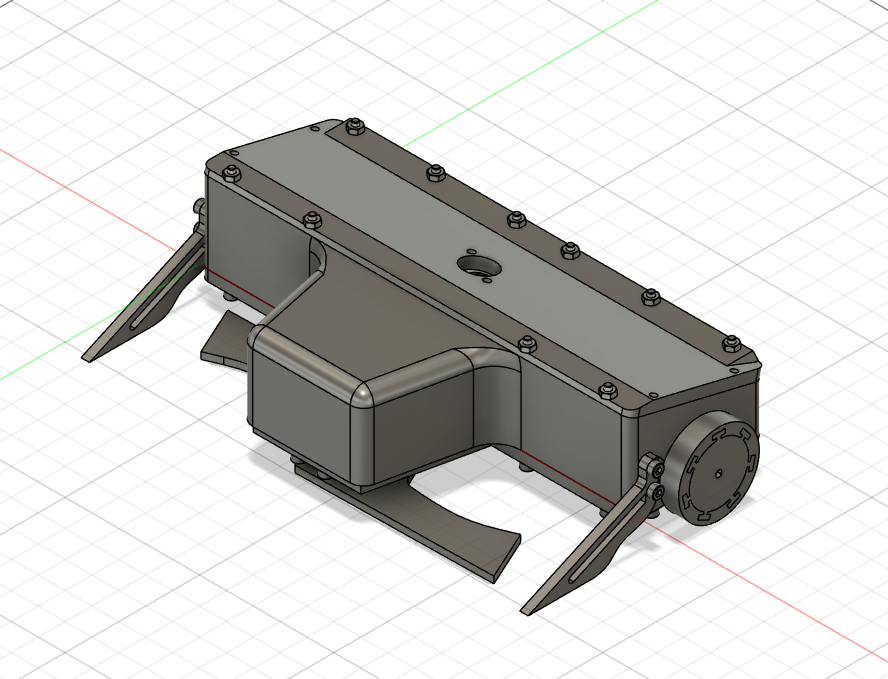
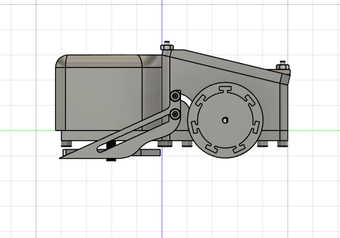
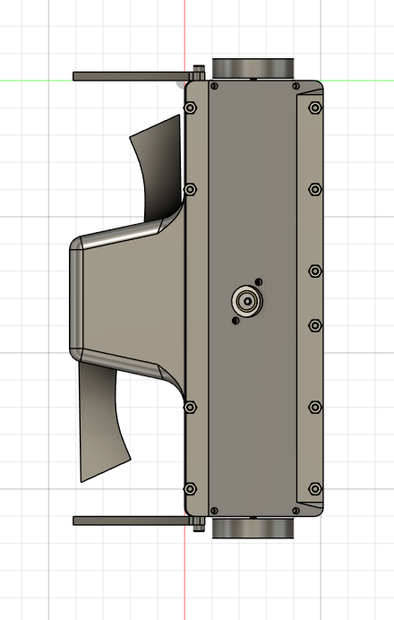

# Undacutta

Undacutta is US Antweight combat robot. This robot (as can be told by the name), is an undercutter. This design choice was primarily driven by 2 causes: undercutters are normally a little advantageous in todays meta, as drums and vert spinners are favored + i think they are cool and niche.

I built this bot because my other bot was kind of bad and I want to compete again, with a better one.

images:

Some important notes:
wheels are cast, I am experimenting with oogoo, but the way the molds are designed it should work fine with vytaflex/smoothon

| Item | Quantity | Total | Shipping | HC Cost | Links |
|------|----------|---------|----------|-------|-------|
| Ovionic 450mah 3s | 2 | $19.21 | - | $19.21 | [Amazon](https://www.amazon.com/OVONIC-Battery-Package-Including-Batteries/dp/B0D3F6NPMF/) |
| ANYCUBIC PLA Plus | 1 | $14.99 | - | $14.99 | [Amazon](https://www.amazon.com/ANYCUBIC-Filament-Toughness-Printing-Dimensional/dp/B0CF1SXM5N/) |
| ELEGOO TPU | 1 | $19.99 | - | $19.99 | [Amazon](https://www.amazon.com/ELEGOO-Filament-Flexible-Printing-Printers/dp/B0DWSDWTW5/) |
| RS2205 2300KV Brushless Motor | 1 | $12.08 | - | $12.08 | [Amazon](https://www.amazon.com/Nawwgy-RS2205-Brushless-Multicopter-Accessories/dp/B0DRVP2CQ8/) |
| Dual way Bidirectional Brushed ESC | 1 | $14.99 | - | $0 | [Amazon](https://www.amazon.com/FPVKing-Bidirectional-Brushed-2S-3S-Control/dp/B081LBL42J/) |
| HiLetgo 2pcs GA12-N20 N20 (12V 1000RPM) | 2 | $9.99 | - | $0 | [Amazon](https://www.amazon.com/HiLetgo-GA12-N20-Reduction-Deceleration-Multiple/dp/B0CHRWS36P/) |
| uxcell M3 x 55mm Alloy Steel Bolt | 1 | $13.59 | - | $13.59 | [Amazon](https://www.amazon.com/gp/product/B01N68JLPE/) |
| 600 Pcs M3 Screws Assortment Kit | 1 | $7.19 | - | $0 | [Amazon](https://www.amazon.com/Screws-Assortment-Plated-Socket-Washers/dp/B0D3X5CT2J/) |
| Just 'Cuz PCB Switch V1.0 | 1 | $4.40 | $4.90 | $4.40 | [Just Cuz Robotics](https://justcuzrobotics.com/products/switch) |
| RadioMaster R84 V2.0 4ch | 1 | $18.99 | - | $18.99 | [Amazon](https://www.amazon.com/RadioMaster-Compatible-Receiver-Radiomaster-Transmitters/dp/B0CRCYM2QL/) |
| 30A 2-4S RC Brushless Motor ESC | 1 | $16.99 | - | $0 | [Amazon](https://www.amazon.com/TOYTENSI-Brushless-Motor-Plane-Airplane/dp/B0CQHLRW3D/) |
| uxcell M3 x 40mm Alloy Steel Hex Bolt | 1 | $9.49 | - | $9.49 | [Amazon](https://www.amazon.com/Alloy-Steel-Socket-Screws-Black/dp/B00W97R5KU/) |
| DAP Silicone Max All Purpose Sealant | 1 | $5.99 | - | $5.99 | [Amazon](https://www.amazon.com/DAP-7079808792-Silicone-Building-Material/dp/B07GQBLMG3/) |
| Argo 100% Pure Corn Starch, 16 Oz | 1 | $2.44 | - | $2.44 | [Amazon](https://www.amazon.com/Argo-100-Pure-Corn-Starch/dp/B00JPT9BFW/) |
| xt30 connectors | 1 | $5.99 | - | $5.99 | [- ](https://www.amazon.com/TMH-Connector-Female-Connectors-Battery/dp/B0D35HMMX7)|
| **Subtotal** | | **$176.32** | | **$133.15** | |
| **Total** | | **$175.23** | | **$137.05** | |
